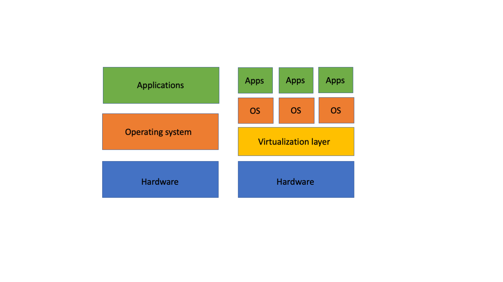
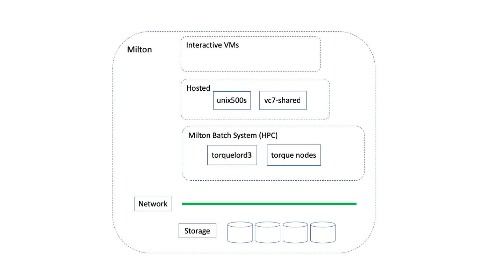
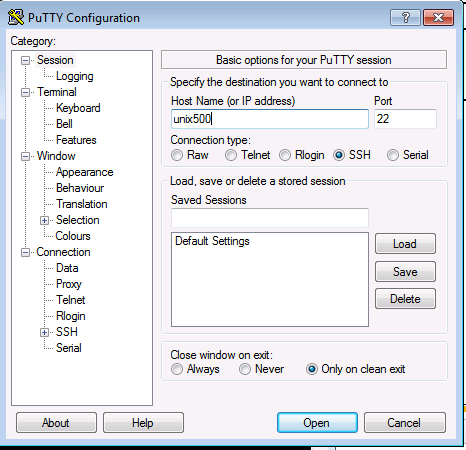
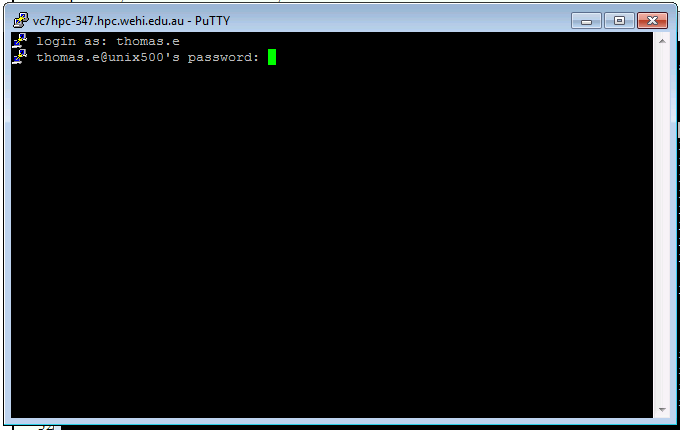

<!-- $theme: default -->

# Introduction to Milton
Evan Thomas
Research Computing

---

# Goals for today
* Part 1: Learning about supercomputers and Milton.
* Part 2: Logging on and exploring the Linux Environment.
* Part 3: Learning about software modules and the batch job submission system.
* Part 4: Submitting test jobs.
* Part 5: PBS Command Summaries
* Part 6: WEHI Filesystems
---


# Slide Respository
* These slides are based on material developed by Lev Lafayette from Research Platform Services at the University of Melbourne.
* A copy of these slides and sample code is available at: `https://github.com/WEHI-ResearchComputing/MiltonIntro`

---
# Getting help I
* More documentation is available on Catalyst: `Catalyst -> Research -> Research Computing`
* Help is available at: `helpdesk@wehi.edu.au`. 
* Other training is also conducted by:
	* Research Platforms: https://research.unimelb.edu.au/infrastructure/research-platform-services
	* Melbourne Bioinformatics: https://www.melbournebioinformatics.org.au/
---

# Getting help II
* Join the slack team: https://milton-wehi.slack.com/signup
	* This is user to user support. ITS do not monitor it.
* Join the MUG mailing list. Send a request to research.computing@wehi.edu.au
---


# Part I: Helpdesk
* Read the Message of the Day when you login!
* If you have 
	* problems with submitting a job
	* need a new application or extension to an existing application installed
	* submissions are generating unexpected errors etc., 
	* Just have a question
* Email helpdesk: `helpdesk@wehi.edu.au`!
* Do not email individual sysadmins; we need consolidated records. Please be informative about the error or issue.
---


# Part 1: Supercomputers and HPC
* "Supercomputer" means any single computer system that has exceptional processing power for its time. 
* One popular metric (LINPACK) is the number of floating point operations per second (FLOPS) such a system can carry out (http://top500.org). HPC Challenge and HPCG are broader, more interesting metrics. 
* High Performance Computer (HPC) is any computer system whose architecture allows for above average performance. High Throughput Computing (HTC) is an architecture for maximum job completion; capability vs capacity computing.
---


# Part 1: Clusters and Research Computing
* Clustered computing is when two or more computers serve a single resource. This improves performance and provides redundancy in case of failure system. Typically commodity systems with a high-speed local network.
* Research computing refers to the concepts and software applications used by the scientific community to aid research. It does not necessarily equate with high performance computing, or the use of clusters. It is whatever researchers use and do. Not issues of producibility and environments.
---


# Part 1: Parallel Computing
* With a cluster architecture, applications can be more easily parallelised across them. 
	* *Data parallel*: running the same task in parallel over different inputs 
	* *Task parallel*: running a single task in parallel with communication. e.g. sequence alignment; molecular dynamics
* Further examples of serial versus parallel; weather forecasting, aerodynamic design, fluid mechanics, radiation modelling, molecullar dynamics, CGI rendering for popular movies, etc. Reality is a parallel system!
---


# Part 1: HPC Cluster and Parallel Processing Components
* A chassis or rack, containing multiple computer system units, interconnect, and providing power.
* Computer system units or *nodes*, containing memory, local disk, and sockets.
* Sockets contain a processor
	* which has several *cores*
    * each core processes to logical streams of instructions (*hyperthreads*)
* The term Central Processing Unit, *CPU*, nearly always refers to hyperthread.
* Logical processes have shared resources (e.g., memory) which may have multiple instruction stream threads.
---

# Part 1: Cloud computing
* Infrastructure as a Service (IaaS)
	* Compute, storage and network
	* Located in managed datacentres
	* Available on demand
	* Pay by the minute
* Commercial Clouds
	* Amazon Web Services (AWS)
	* Google Cloud Platform
	* Microsoft Azure
* Research Clouds
	* National eResearch Collaboration Tools and Resources project (Nectar)
* Private clouds
	* WEHI Research cloud - Milton!
---

# Part 1: Virtualization
* Modern data centres present resources in *virtual machines* (VMs)
* Software running in a VM sees CPUs, memory, disk, network as though they are real
* A physical node may run serveral *virtual machines*
	* Node and machine are used interchangeably 
* This has a lot of advantages:
	* different applications and users can be isolated from each other
	* Multiple operating systems can run in the same hardware
	* Machines can be easily moved between different hardware to provide the best resource utilisation
* Milton uses VMWare data centre software to provide virtualization.
---

# Part 1: Virtualization



---

# Part 1: Milton Hardware
* In 2016 WEHI purchased an _on premise_ High Performance Computer called Milton.
* nearly 2500 cores (2 hyperthreads per core)
	* A mix of Skylake and Broadwell Intel processors
	* Up to 56 cores in a single physical node
* 40TB RAM
	* configurations from 128GB to 1.5TB (can be reconfigured if required)
* A mix of 40GbE and 10GbE network connnections
* 20 nVidia P100 GPUs 

---

# Part 1: Milton overview


---


# Part 1: Logging In
* To log on to Milton you need a WEHI logon - that's is!
* Mac OS 10.x. 
	* Open a terminal
	* `ssh unix500`
	* Type your password
* For MS-Windows users, the free PuTTY client is recommended (http://putty.org).
* ***Note:*** Logging into other systems may be more complicated. e.g.  `ssh eat@spartan.hpc.unimelb.edu.au`
---

# Part 1: Logging in from Windows


---

# Part 1: Logging in from Windows


---


# Part 1: SSH Keys, Config, Data Transfers
* Consider using an `.ssh/config` file and using passwordless SSH by creating a keypair and adding to your `.ssh/authorized_keys` file on Spartan.
* SSH Keys will make your life easier. Follow the instructions here: https://dashboard.hpc.unimelb.edu.au/faq/#how-do-setup-passwordless-ssh-login
---


# Part 2: It's a Linux Command Line World 


* The command line interface (CLI) provides a great deal more power and is very resource efficient.
* Linux scales and does so with stability and efficiency.
* Critical software such as the Message Parsing Interface (MPI) and nearly all scientific programs are built for Linux. 
* The operating system and many applications are provided as "free and open source" which are better placed to improve, optimize and maintain.
---


# Part 2: File System Hierarchy
* Files are organised in a hierachy of directories (or folders)
* When a user logs in on a Linux or other UNIX-like system on the command line, they start in their _home_ directory (`/home/<username>`). 
	* WEHI user names are usually `lastname.i`, e.g. `thomas.e` 
* "Everything in the UNIX system is a file" (Kernighan & Pike, 1984, 41). 
* See https://swcarpentry.github.io/shell-novice/fig/standard-filesystem-hierarchy.svg
---


# Part 2: Exploring The Environment

| Command     | Explanation |
|:------------|:---------------------------------------------------------:|
|`whoami`   | "Who Am I?; prints the effective user id                                  |
|`pwd`      | "Print working directory"|
|`ls`       | "List" directory listing  |
---


# Part 2: Command Options
* Linux commands often come with options expressed as: `<command> --<option[s]>`
* Options can be expressed as full words or abbreviated characters.

| Command     | Explanation                                                                |
|-------------|:----------------------------------------------------:|
|`ls -lart`| Directory listing with options (long, all, reverse time)|
|`ls -lash`   | Directory listing with options (long, all, size in human readable	   |
---


# Part 2: Getting command help
Linux commands come with "man" (manual) pages, which provide a terse description of the meaning and options available to a command. A verbose alternative to man is info. 

| Command             | Explanation                               |
|:--------------------|:------------------------------------------|
|`<command> --help`   | Command help summmary (usually)           |
|`man <command>`      | Display the manual entry for the command  |
|`info <command>`     | A verbose description of the command      |
|`whatis <command>`   | A terse description of the command        |
---

# Part 2: the `less` command
* used for conviently viewing large amounts of text
* try `less /stornext/HPCScratch/evan/training/Lesson_1.md`

| Key stroke    | Explanation    |
|:--------------|:---------------|
| `<space bar>` | page down      |
| `u`           | page up        |
| `/<text>`     | find forwards  |
| `?<text>`     | find backwards |
| `g`           | goto to top    |
| `G`           | goto to bottom |
| `q`           | quit           |
| `h`           | help           |

---

# Tab to completion
* Hit `<tab>` and the current text will complete if there is a unique completion
* Hit `<tab>` twice to get a list of possible completions
* Try it: `ls -l /stornext/HPCScratch/evan/training/Lesson_1.md`
___
 

# Part 2: Pipes
Linux also have very useful 'pipes' and redirect commands. To pipe one command through another use the '|' symbol.

| Command            | Explanation                                                         |
|:-------------------|:-------------------------------------------------------------------:|
| <code>who -u  &#124; less</code> | "Who" shows who is logged on and how long they've been idle.        |
| <code>ps afux &#124; less</code> | "ps" provides a list of current processes. Check `man ps`           |
---


# Part 2: Redirects
To redirect output use the '>' symbol. To redirect input (for example, to feed data to a command) use the '<'. Concatenation is achieved through the use of '>>' symbol. 

| Command         | Explanation         |
|:----------------|:-------------------:|
| `w > list.txt`  | 'w' is a combination of who, uptime and ps -a, redirected|
| `w >> list.txt` | Same command, concatenated|
---


# Part 2: Files and Text Editing I
* Linux filenames can be constructed of any characters except the forward slash, which is for directory navigation. However it is best to avoid punctuation marks, non-printing characters (e.g., spaces). It is *much* better to use underscores or CamelCase instead of spaces, newlines etc (including in job names).
* Linux is case-sensitive with its filenames (e.g., list.txt, LIST.txt lisT.txT are different).
---

# Part 2: Navigating the file system

| Command | Explanation      |
|:--------|:-----------------|
| `cd`    | change directory |
| `pwd`   | present working directory |
* Files are located via paths
* Paths can be 
	* absolute - the start with a '/'
	* relative to the working directory - without a leading '/'
    * `.` means the current directory
    * `..` means up one directory
* Demonstrate on the terminal  

---

# Part 2: Files and Text Editing II
* Files do not usually require a program association suffix, although you may find this convenient (a C compiler like files to have .c in their suffix, for example). 
* The type of file can be determined with the `file` command. The type returned will usually be text, executable binaries, archives, or a catch-all "data" file.
	* `file /stornext/HPCScratch/evan/training/Lesson_1.md`
	* `file /stornext/HPCScratch/evan/training/random.bam`
* There are three text editors usually available on Linux systems on the command-line. These are `nano` (1989, as `pico`) and `vim` (or `vi`), and or `emacs` (both 1976). See `https://www.vimgolf.com/`
	* nano is probably the easiest to start with.
---


# Part 2: Copying Files to a Local System
To get a copy of the files from an external source to your home directory, you will probably want to use `wget`, or `git`, or `scp`.

| Command       | Explanation          |
|:--------------|:----------------:|
| `wget URL`      | Non-interactive download of files over http, https, ftp etc. |
| `git clone URL` | Clone a repository into a new directory.  |
---


# Part 2: Copying Files Within a Local System 
To copy a file from within a system use the `cp` command. Common options include `-r` to copy an entire directory

| Command           | Explanation        |
|:------------------|:------------------:|
| `cp source destination` | Copy a file from source to destination |
| `cp -r source destination` | Recursive copy (e.g., a directory)  |
| `cp -a source destination` | Recursive copy as archive (permissions, links)|
---

# Part 2: Copying
Try 
`cp list.txt list2.txt`
`cp -r /stornext/HPCScratch/evan/training .`


# Part 2: Copying Files Between Systems
To copy files to between systems desktop use SCP (secure copy protocol) or SFTP (secure file transfer protocol), combining the ssh and cp functionality. The `cp` options can also be used. The source or destination address should also require a remote shell login.

| Command     | Explanation     |
|:------------|:---------:|
| `scp source.address:/path/ destination.address:/path/`| Copies files on a network        |
---


# Part 2: Synchronising Files and Directories I
* The `rsync` utility provides a fast way to keep two collections of files "in sync" by tracking changes.    
* The source or destination address should also require a remote shell login.    
For example; `rsync -avz --update lev@spartan.hpc.unimelb.edu.au:files/workfiles .`
---


# Part 2: Synchronising Files and Directories II

| Command           | Explanation |
|:------------------|:-----------:|
| `rsync source destination`| General rsync command  |
| `rsync -avze ssh username@remotemachine:/path/to/source .` | With ssh encryption |
---


# Part 2: Synchronising Files and Directories III
* The `rsync -avz` command ensures that it is in archive mode (recursive, copies symlinks, preserves permissions), is verbose, and compresses on transmission. 
* The `--update` option restricts the copy only to files that are newer than the destination. 
* Note that rsync is "trailing slash sensitive". A trailing / on a source means "copy the contents of this directory". Without a trailing slash it means "copy the directory".
---


# Part 2: Synchronising Files and Directories IV
* Rsync can be used in a synchronise mode with the --delete flag.  Consider this with the `-n`, or `--dry-run` options first!

| Command           | Explanation    |
|:------------------|:--------------:|
| `rsync -avz --update source/ username@remotemachine:/path/to/destination| Synchronise, keep older files  |
| `rsync -avz --delete source/ username@remotemachine:/path/to/destination| Synchronise, absolutely |
---

# Part 2: Creating Directories, Copying and Moving Files
* Directories can be created with the `mkdir` command (e.g., `mkdir braf`).
* Files can be copied with the `cp` command 
	* `cd` - change you you home directory	 
	* `cp /stornext/HPCScratch/evan/training/gattaca.txt ~` copy a file to you home directory
	* `cp gattaca.txt gattaca2.txt` make another copy of the file
* Files can be moved or _renamed_ with the `mv` command (e.g., `mv gattaca2.txt braf`)
---

# Part 2: File Differences
* File differences can be determined by timestamp (e.g., `ls -l gattaca.txt braf/gattaca2.txt`)
* `nano gattaca.txt` and make a change
* Content differences can be determined by the `diff` command (e.g., `diff gattaca.txt braf/gattaca2.txt`)
* For a side-by-side representation use the command `sdiff` instead.
* The command `comm` can compare two files, lines by line (e.g., `comm gattaca.txt braf/gattaca2.txt`).
* `cmp` will simply report if there is a difference
---


# Part 2: Searches and Wildcards
* Simple file searches
	* `ls braf/*.txt`
	* `ls /stornext/HPCScratch/evan/training/*.bam`
* To search for files in an entire direcotry tree use the find command 
	* `find . -name \*.txt'`
* To search within files, use the `grep` command (e.g., `grep -i NEV braf/*` or `grep -l`)
* The most common wildcard is `*`, but there is also `?` (single character).
* There are also range searches (e.g., `[a-z]` any character between a and z, inclusive)
---


# Part 2: Deletions
* Files can be deleted with the `rm` command (e.g., `rm gattaca.txt`)
* Empty directories can be deleted with the `rmdir` command (e.g., `rmdir braf`)
* Directories, files, subdirectories etc can be delted with `rm -rf <<dir>>`
* BE VERY CAREFUL
	* ESPECIALLY WITH WILDCARDS! 
	* THERE IS NO UNDO OR TRASH! 
	* THERE MAY BE NO BACKUP!
* Consider the difference between `rm matlab *` to `rm matlab*`.
---


# Part 3: A Dynamic Software Environment
* Software on Milton Linux systems (and many other HPCs) is provided by the module system
* Manages diverse software requirements in complex multi-user systems.
* Manages dependencies
* Allows multiple versions of the same program
---


# Part 3: Module Commands I
| Command                       | Explanation                                            |
|-------------------------------|:------------------------------------------------------:|
| `module help`                 | List of switches, commands and arguments for modules   |
| `module avail`                | Lists all the modules which are available to be loaded.|
| `module avail <string>`       | Lists all the modules starting with `<string>`         |
| `module avail 2>&1 | grep <string>` | Lists all the modules containing `<string>`      |
| `module display <modulefile>` | Display paths etc for modulefile                       |
---


# Part 3: Module Commands I
| Command                       | Explanation                                            |
|-------------------------------|:------------------------------------------------------:|
| `module load <modulefile>`    | Loads paths etc to user's environment                  |
| `module unload <modulefile>`  | Unloads paths etc from user's environment.             |
| `module list`                 | lists all the modules currently loaded.                |
---


# Part 3: Portable Batch System I
* The Portable Batch System (or simply PBS) performs job scheduling by assigning unattended background tasks expressed as batch jobs, among the available resources.
* Originally developed by MRJ Technology Solutions under contract to NASA in the early 1990s. Released as an open-source product as OpenPBS. Forked by Adaptive Computing as TORQUE (Terascale Open-source Resource and QUEue Manager). Many of the original engineering team now part of Altair Engineering who have their own commercial version, PBSPro.
* A batch system typically consists of a resource manager (e.g., TORQUE) and a job scheduler (e.g., Maui, Moab)
* Our batch system is called **Torquelord3** (TL3)

---


# Part 3: Slurm Workload Manager
* Slurm, used at UoM on Spartan and many sites, was developed as a collaborative effort primarily by Lawrence Livermore National Laboratory, SchedMD, Linux NetworX, Hewlett-Packard, and Groupe Bull as a Free Software resource manager. As of November 2015, TOP500 list of most powerful computers in the world indicates that Slurm is the workload manager on six of the top ten systems. Slurm's design is very modular with about 100 optional plugins.
---


# Part 3: Job Submission Principles
* The steps for job submission are (a) setup and launch., (b) monitor., and (c) retrieve results and analyse. 
* Jobs are launched from a _submit_ node with resource requests and, when the job scheduler decides, run on compute nodes.
	* most Milton nodes can act as submit nodes
	* c.f. _login_ node
* Job scripts are simply resource requests (understood by scheduler), a batch of commands (understood by shell) with output to files.
---


# Part 3: Fair Share
* A cluster is a shared environment thus a a resource requesting system. Policies ensure that everyone has a "fair share" to the resources (e.g., user processor limits).
* TL3 treats all users and all resources equally.
* No single user can have mode than 75% of total processors
* Heavy users over the previous 7 hours will have lower priority compared to lighter users
* Precise details of fair share are likely to change over time.
---


# Part 3: Backfilling
* Many schedulers and resource managers use a backfilling algorithm to improve system utilisation and maximise job throughout. 
* When more resource intensive jobs are running it is possible that gaps ends up in the resource allocation. To fill these gaps a best effort is made for low-resource jobs to slot into these spaces.
* For example, on an 8-core node, an 8 core job is running, a 4 core job is launched, then an 8 core job, then another 4 core job. The two 4 core jobs will run before the second 8 core job.
---


From the IBM 'Red Book' on Job Submission.

---


# Part 3: What to run and what not to run on unix500
* unix500 is a shared resource
* Primarily for 
	* test and development
	* script and file preparation
* Some heavy processing is OK
	* 8 CPUs
	* 24 GB memory
	* 24 hours elapsed time
* The batch system will be more stable and more performant
---


# Part 3: Queues
* Jobs are submitted to queues
	* different resource types, e.g. GPU nodes
	* different service levels, usually coupled to resource constraints
* Milton queues are:

| Queue                         | Purpose                                                |
|-------------------------------|:------------------------------------------------------:|
| submit                        | Standard nodes, suitable for most jobs. Default if not queue is specified|
| submit_2xp100                 | Nodes with GPUs                                        |
| skylake                       | Nodes with Intel Skylake CPUs                          |


---

# Part 3: Basic steps
* Develop a shell script, a text file of commands, to perform the work
	* load modules and other enviromental setup
	* run commands
* Submit job with appropriate resources
* Monitor your jobs
* Check job output and expected output files.
---

# Part 3: A script
```bash
#!/bin/bash
cd <my-work-dir>
module load myapp
myapp data
```
---

# Part 3: Resources
* The system needs to know what resources your jobs needs so it can schedule your job into an appropriate node and reserves the resources you have requested

| Resource                      | Explanation                                            |
|-------------------------------|:------------------------------------------------------:|
| nodes                         | Number of nodes                                        |
| ppn                           | processors (i.e. CPUs) per node                        |
| mem                           | amount of memory                                       |
| walltime                      | maximum elapsed time                                   |
---

# Part 3: Submit a job - command line resources

```
qsub -l nodes=1:ppn=2,mem=8gb,walltime=01:00:00 <script>
```

**Note:** commas and colons

---

# Part 3: Submit a job - script resources
```bash
#!/bin/bash
#PBS -l nodes=1:ppn=2,mem=8gb,walltime=01:00:00 
cd <my-work-dir>
module load myapp
myapp data
```
or
```bash
#!/bin/bash
#PBS -l nodes=1:ppn=2
#PBS -l mem=8gb
#PBS -l walltime=01:00:00 
cd <my-work-dir>
module load myapp
myapp data
```
then
```
qsub <script>
```

---

# Part 3: After you submit your job
* Your job is placed in a queue and job id is assigned
* Your job will have a name, which will be the script name by default
* It may take while before your job runs if the system is busy
* The job will start in your home directory not the directory where you submitted you job!
* Job output will go to the directory where the job was submitted.
* Two output files are created by default
	* `<jobname>.o<jobid>` which contains program `stdout`
	* `<jobname>.e<jobid>` which contains program `stderr`
---

# Part 3: Monitoring your job
To see all the jobs in the queue
```
qstat
```
To see just your, somebody else's jobs
```
qstat -u <userid>
```

Interpreting job status
| Status                    | Explanation                    |
|---------------------------|:------------------------------:|
| Q                         | Queued                         |
| R                         | Running                        |
| C                         | Complete                       |

---


# Part 2: Killing jobs
```
qdel <jobid>
```
or
```
qdel all
```
---


# Part 4: Interactive Jobs
* An interactive job, based on the resource requests made on the command line, puts the user on to a compute node. This is typically done if they user wants to run a  large script (and shouldn't do it on the login node), or wants to test or debug a job. The  following command would launch one node with two processors for ten minutes.
```
qsub -I -l nodes=1:ppn=2,mem=1gb,walltime=00:10:00
```
---

# Part 4: Worked example

```bash
mkdir -p ~/braf
cd ~/braf
cp /stornext/HPCScratch/evan/training/S1_R* .
cp /stornext/HPCScratch/evan/training/align.sh .
ls -l
nano align.sh
qsub -l nodes=1:ppn=1,mem=4gb,walltime=01:00:00 align.sh 
qstat -u <userid>
ls align.sh.*
cat align.sh.*
```

---

# Part 4: Exercise
Rerun the same job with 6 CPUs

1. Work out how to tell bowtie2 to use more CPUs
	1. `module load bowtie2`
	2. `bowtie2 --help`
2. Modify the script 
3. Submit with the appropriate invocation of `qsub`

---
# Part 5: PBS commands: qsub
* `man qsub`
* google (but there are variants)

| Option                   | explanation                 | 
|--------------------------|-----------------------------|
| `-l`                     |resources (required)         |
| `-q <queue>`             |queue                        |
| `-N <name>`              |jobname                      |
| `-m <options>`           |email options                |
| `-M <email>`             |email addresses              |
| `-j eo`                  |combine output streams       |
| `-e <path>`, `-o <path>` |locations for output streams |
---


# Part 5: PBS environment variables
| Variable          | explanation                | 
|-------------------|----------------------------|
| `PBS_O_HOST`      | execution host             |
| `PBS_O_WORKDIR`   | directory where `qsub` ran |
| `PBS_JOBID`       | jobid                      |
| `PBS_JOBNAME`     | jobname                    |

e.g. `cd $PBS_O_WORKDIR`

---

# Part 5: PBS commands: qstat
* `man qstat`
* google (but there are variants)
* most `qstat` commands can be limited to a jobid or user

| Option         | explanation                  | 
|----------------|------------------------------|
| `-u <userid>`  | only for that user           |
| `-n`, `-n1`    | show nodes                   |
| `-f`           | full report                  |
| `-q`, `-Q`     | show queues                  |
| `-a`           | alternative format           |
| `-x`           | XML format                   |
| `-e`, `-o`     | locations for output streams |
---

# Part 6: WEHI filesystems
##  Home areas
What does "home area" mean?
* Linux:
	* The directory you start in when you login
	* location of special files
	* `$HOME` and `~`
    * These will be different on different systems
---


# Part 6: WEHI filesystems
##  Home areas
* Mac:
	* The folder named with your userid on FS_ALL
	* You need to manually "connect to server ..." from the finder
* Windows
	* W: drive should be mapped automatically
---

# Part 6: WEHI Home areas
* In most milton nodes, including unix500, the home area is `/home/<userid>`
	* also visible as `/stornext/HPCScratch/home/<userid>`
* Desktop or main home area is `/wehisan/home/allstaff/<s>/<surname.i>/`
* This is also the home area for the old unix3xx and unix4xx home areas
* To copy data from your desktop
	* copy to your home with the finder/explorer
	* copy from "main" home area to your "milton" home area
* Milton home areas are on HPCScratch and are **not** backed up
---

# Part 6: WEHI lab areas
* All data are owned by the lab, then the division then the institute
* Most labs will have a lab area for their data.
* All valuable data should on a lab area - these are backed up
* Use the Milton home area for temporary data
---

# Slide Respository
* These slides are based on material developed by Lev Lafayette from Research Platform Services at the University of Melbourne.
* A copy of these slides and sample code is available at: `https://github.com/WEHI-ResearchComputing/MiltonIntro`

---


---
